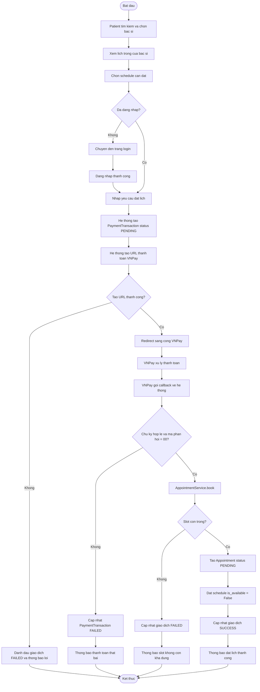
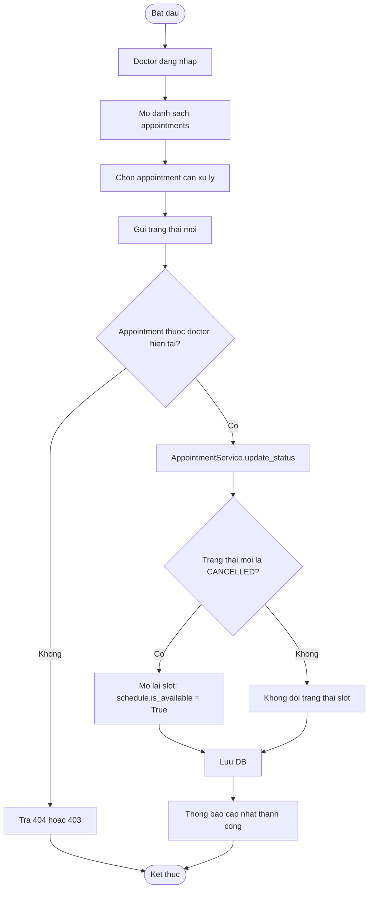
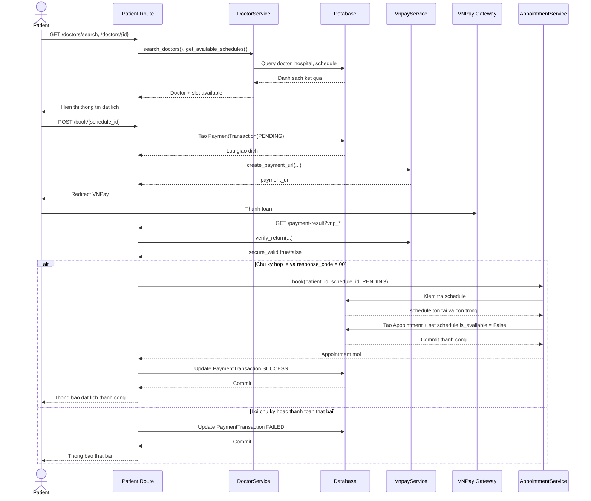
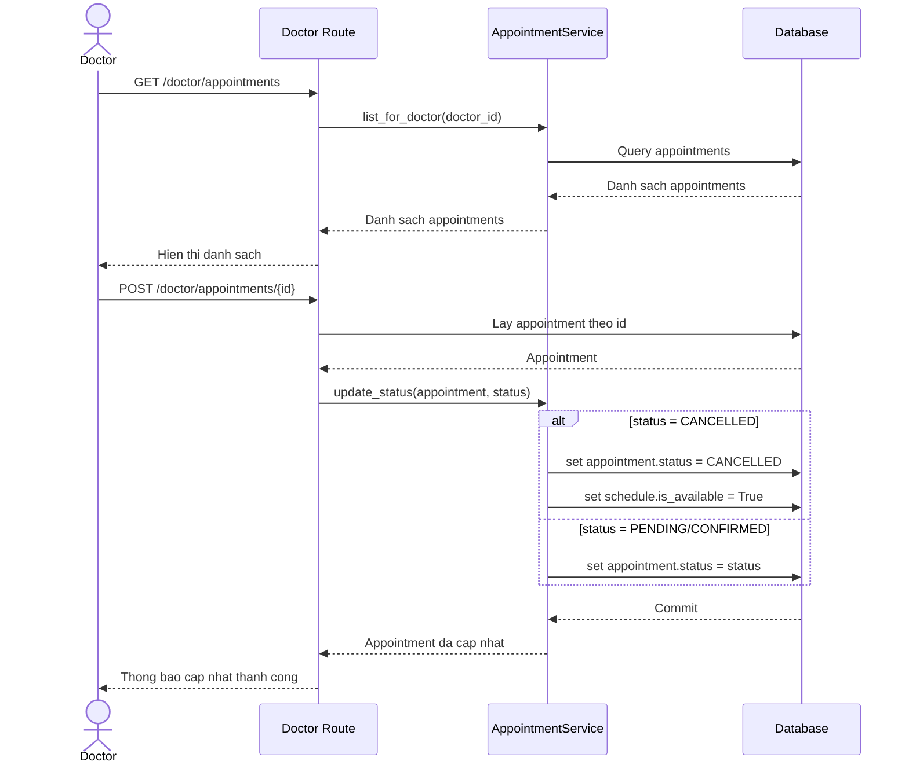

# Phan tich Use Case, Activity va Sequence Diagram

## 1. Tong quan he thong

Project la he thong dat lich kham benh xay dung bang Flask, MySQL va Bootstrap 5. He thong ho tro 3 vai tro chinh:

- `Patient`: tim kiem bac si, xem lich trong, thanh toan va dat lich, xem lich hen
- `Doctor`: cap nhat ho so, quan ly ca lam/lich kham, xem va cap nhat trang thai lich hen
- `Admin`: xem dashboard nguoi dung, loc tim kiem va xoa tai khoan khong phai admin

Thanh phan chinh duoc suy ra tu code:

- Route: `auth_routes.py`, `patient_routes.py`, `doctor_routes.py`, `admin_routes.py`
- Service: `auth_service.py`, `doctor_service.py`, `appointment_service.py`, `schedule_service.py`, `vnpay_service.py`
- Model: `User`, `Doctor`, `Schedule`, `Appointment`, `PaymentTransaction`, `Hospital`, `WeeklyShift`

## 2. Bang Use Case

| Ma UC | Ten use case | Actor | Mo ta ngan | Tien dieu kien | Hau dieu kien |
| --- | --- | --- | --- | --- | --- |
| UC01 | Dang ky tai khoan | Guest | Tao tai khoan `PATIENT` hoac `DOCTOR` | Chua dang nhap | Tai khoan moi duoc tao, doctor co them ho so neu role la `DOCTOR` |
| UC02 | Dang nhap | Guest, User | Xac thuc username/password va chuyen den dashboard phu hop | Da co tai khoan hop le | User dang nhap vao he thong |
| UC03 | Dang xuat | Patient, Doctor, Admin | Ket thuc phien dang nhap | Da dang nhap | User bi dang xuat |
| UC04 | Tim kiem bac si | Guest, Patient | Tim theo ten bac si, benh vien, chuyen khoa, so nam kinh nghiem | He thong co du lieu bac si | Danh sach bac si phu hop duoc hien thi |
| UC05 | Xem chi tiet bac si | Guest, Patient | Xem thong tin bac si va lich trong | Bac si ton tai | Thong tin va slot trong duoc hien thi |
| UC06 | Chon lich kham moi | Patient | Chon benh vien, bac si, ngay kham de xem slot trong | Da dang nhap vai tro `PATIENT` | Danh sach slot phu hop duoc hien thi |
| UC07 | Thanh toan va dat lich | Patient | Tao giao dich VNPay, callback thanh cong thi tao appointment | Da dang nhap, slot ton tai va con trong | Tao `PaymentTransaction`, neu thanh cong tao `Appointment` trang thai `PENDING` |
| UC08 | Xem dashboard benh nhan | Patient | Xem danh sach lich hen cua minh | Da dang nhap vai tro `PATIENT` | Danh sach appointment duoc hien thi |
| UC09 | Xem profile benh nhan | Patient | Xem thong tin ca nhan va lich hen | Da dang nhap vai tro `PATIENT` | Thong tin ca nhan duoc hien thi |
| UC10 | Cap nhat ho so bac si | Doctor | Sua chuyen khoa, kinh nghiem, mo ta, benh vien | Da dang nhap vai tro `DOCTOR` | Ho so bac si duoc cap nhat |
| UC11 | Quan ly ca lam viec tuan | Doctor | Them, xem, xoa weekly shift va sinh slot 7 ngay toi | Da dang nhap vai tro `DOCTOR` | Weekly shift va cac schedule tuong ung duoc cap nhat |
| UC12 | Quan ly lich kham | Doctor | Tao, sua, xoa slot kham | Da dang nhap vai tro `DOCTOR` | Schedule duoc them/sua/xoa neu hop le |
| UC13 | Xem danh sach lich hen | Doctor | Xem cac appointment cua minh | Da dang nhap vai tro `DOCTOR` | Danh sach appointment duoc hien thi |
| UC14 | Cap nhat trang thai lich hen | Doctor | Chuyen trang thai `PENDING/CONFIRMED/CANCELLED` | Appointment thuoc doctor dang dang nhap | Trang thai appointment thay doi; neu `CANCELLED` thi mo lai slot |
| UC15 | Xem dashboard quan tri | Admin | Xem va loc danh sach user theo nhieu tieu chi | Da dang nhap vai tro `ADMIN` | Danh sach user duoc hien thi |
| UC16 | Xoa nguoi dung | Admin | Xoa tai khoan `PATIENT` hoac `DOCTOR` cung du lieu lien quan | Da dang nhap vai tro `ADMIN`, user ton tai va khong phai admin | Tai khoan va mot so du lieu lien quan bi xoa |

## 3. Quan he actor - use case

| Actor | Use case chinh |
| --- | --- |
| Guest | UC01, UC02, UC04, UC05 |
| Patient | UC03, UC04, UC05, UC06, UC07, UC08, UC09 |
| Doctor | UC03, UC10, UC11, UC12, UC13, UC14 |
| Admin | UC03, UC15, UC16 |

## 4. Activity Diagram

### 4.1. Luong dat lich va thanh toan VNPay

### 4.2. Luong doctor cap nhat trang thai lich hen

## 5. Sequence Diagram

### 5.1. Sequence dat lich qua VNPay

### 5.2. Sequence doctor cap nhat trang thai appointment

## 6. Ghi chu phan tich theo code

- Luong dat lich hien tai bat buoc qua thanh toan VNPay roi moi tao appointment.
- `Appointment.status` co 3 gia tri: `PENDING`, `CONFIRMED`, `CANCELLED`.
- Khi huy lich (`CANCELLED`), he thong mo lai slot bang cach dat `schedule.is_available = True`.
- `Schedule` co rang buoc unique theo `doctor_id + date + start_time + end_time`.
- Admin co dashboard loc user va co the xoa `PATIENT`/`DOCTOR`, nhung khong duoc xoa `ADMIN`.
- Tu README va route, `Admin` hien chua co use case chi tiet nhu tao user, sua user hay duyet lich hen.

## 7. File code tham chieu

- [app/routes/auth_routes.py](/E:/OU/QL1/app/routes/auth_routes.py)
- [app/routes/patient_routes.py](/E:/OU/QL1/app/routes/patient_routes.py)
- [app/routes/doctor_routes.py](/E:/OU/QL1/app/routes/doctor_routes.py)
- [app/routes/admin_routes.py](/E:/OU/QL1/app/routes/admin_routes.py)
- [app/services/auth_service.py](/E:/OU/QL1/app/services/auth_service.py)
- [app/services/doctor_service.py](/E:/OU/QL1/app/services/doctor_service.py)
- [app/services/appointment_service.py](/E:/OU/QL1/app/services/appointment_service.py)
- [app/services/schedule_service.py](/E:/OU/QL1/app/services/schedule_service.py)
- [app/services/vnpay_service.py](/E:/OU/QL1/app/services/vnpay_service.py)
